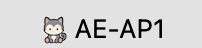

# APMenuBar

A macOS menu bar app that shows which UniFi access point your Mac is connected to.



That's the whole point of it: the name of the AP you're on, at a glance, without opening
the UniFi console or option-clicking the Wi-Fi icon.

## Why it asks the controller instead of the Wi-Fi card

The obvious implementation — read the BSSID from CoreWLAN and map it to an AP — doesn't
work on a modern macOS. The BSSID is treated as location data and is redacted from every
process that lacks Location authorization:

```
$ ipconfig getsummary en0 | grep BSSID
  BSSID : <redacted>
```

`wdutil info` redacts it too, and the `airport` CLI no longer exists. Only a signed app
bundle that has been granted Location Services can read it.

So APMenuBar asks the controller instead: which AP is this client associated with? That
needs no Location permission at all, and the AP names come back exactly as you named them.

## Requirements

- macOS 14 or later
- A UniFi Network controller reachable on your LAN — self-hosted or a UniFi OS console
- A **local, read-only admin account** on that controller

Ubiquiti SSO accounts do not work for the local API. They fail with
`423 SSO_ACCOUNT_LOCKED` or a plain `401`. When you create the admin, pick the option that
asks you to type a password rather than the one that sends an email invitation.

> UniFi → Settings → Admins & Users → Add Admin → **Local Access Only**, role **Viewer**

## Install

Download the `.dmg` from Releases and drag the app to `/Applications`. It is signed with a
Developer ID and notarized, so it opens without a Gatekeeper warning.

On first launch, Settings opens by itself. Fill in your controller's address, the site ID
(almost always `default`), and the admin username and password. The password goes into
your login keychain — never into the app's preferences. Press **Test** to check the
credentials before committing them, then **Apply**.

macOS will ask for **Local Network** permission the first time it contacts the controller.
It must be granted; without it every request fails.

## What it shows

The menu bar shows the AP name and nothing else. Other states:

| Shown | Meaning |
|---|---|
| `AE-AP1` | connected to that AP |
| `Set up` | not configured yet |
| `—` | Wi-Fi is off or not associated |
| `?` | on Wi-Fi, but the controller doesn't recognise this Mac |
| `!` | controller unreachable, login rejected, or no keychain password |

The menu lists every AP on the site with a `✓` against the current one, plus the MAC the
controller sees, **Force re-roam**, **Refresh now**, **Settings…**, **Launch at login**,
**About** and **Quit**.

### Force re-roam

Drops the Wi-Fi link so macOS re-selects an access point. Useful when you've moved rooms
and your Mac is still clinging to a distant AP. It cannot choose the destination — see
below — and will usually land on the same AP if that one really is the strongest.

## What it deliberately does not do

**Switch to a chosen access point.** This isn't an omission; it isn't possible.

- The UniFi API has no steering command. `stamgr` offers `kick-sta`, `block-sta`,
  `unblock-sta` and `forget-sta` — disconnect, but never "put this client on AP 2".
- macOS accepts `CWInterface.associate(to:)` with a `CWNetwork` carrying a specific BSSID,
  returns success, and then associates wherever it likes.

The second one is the trap, because it looks like it works. `Sources/RoamSpike` and
`spike/roam.swift` are kept in the repo as the evidence: with the PSK supplied and the link
dropped first, `associate()` succeeded and the Mac sat on the original AP for all twelve
polls afterwards.

Under 802.11 the client picks the AP. Controllers can influence that with minimum-RSSI and
band steering, but nothing can dictate it.

## Building

No Xcode project — `build.sh` assembles and signs the bundle directly.

```bash
./build.sh            # build and sign into build/APMenuBar.app
./build.sh run        # ... then launch it from build/
./build.sh install    # ... then replace /Applications copy and relaunch
./build.sh release    # Developer ID signed, notarized, stapled .dmg
```

`release` needs a Developer ID Application certificate and stored notary credentials:

```bash
xcrun notarytool store-credentials APMenuBar-notary \
  --apple-id <your-apple-id> --team-id <your-team-id>
```

The marketing version comes from `VERSION`; the build number is the commit count, so it
increments on its own.

### Icon

```bash
./make-icon.sh artwork.png [overrides-dir]
```

Strips an opaque background by flood-filling from the edges, pads non-square art rather
than squashing it, and generates every size. An optional overrides directory supplies
hand-drawn files for the small sizes — worth doing for 16 and 32, which is what the menu
bar actually draws and where downscaling destroys detail.

## How it works

Every poll it reads `en0`'s current link-layer address, asks the controller
`/api/s/<site>/stat/sta` for the matching client, and maps that client's `ap_mac` through
`/api/s/<site>/stat/device` to a name. Polling is adaptive: 5 s while the menu is open or
just after a change, 30 s idle, 10 s after a failure, suspended while the display sleeps.

The MAC is re-read on every poll because Private Wi-Fi Address randomises it and macOS
rotates it periodically. The controller's self-signed certificate is pinned by SHA-256 on
first connection rather than skipping TLS validation.

## Troubleshooting

**"The Internet connection appears to be offline" on a machine that's online.** This is the
Local Network privacy gate, not your network. Approval is bound to the binary's cdhash, so
every rebuild silently invalidates it; `build.sh` clears the stale entry each build. For an
installed copy, re-enable it under System Settings → Privacy & Security → Local Network.

**`?` — the controller doesn't recognise this Mac.** Usually the private MAC rotated, or
you're on Ethernet, or the site ID is wrong. The menu shows the MAC being matched, so you
can compare it against the client list in the UniFi console.

**AP names show as MAC addresses.** The admin can read `stat/sta` but not `stat/device`.
Give it a slightly higher role.

**"Controller certificate changed".** The pin no longer matches. If you regenerated the
certificate deliberately, clear the pin and it will trust the next one it sees:

```bash
defaults delete com.3jco.apmenubar certFingerprint
```

## Layout

```
Sources/APMenuBar/    the app
Sources/RoamSpike/    throwaway spike proving AP switching is impossible
spike/                unifi-probe.sh (endpoint discovery), roam.swift
build.sh              build, install, release
make-icon.sh          artwork -> AppIcon.icns
```

Diagnostics are written to `/tmp/apmenubar.log`, since an agent app has no console.

---

© 2026 Three Jay Company AB
